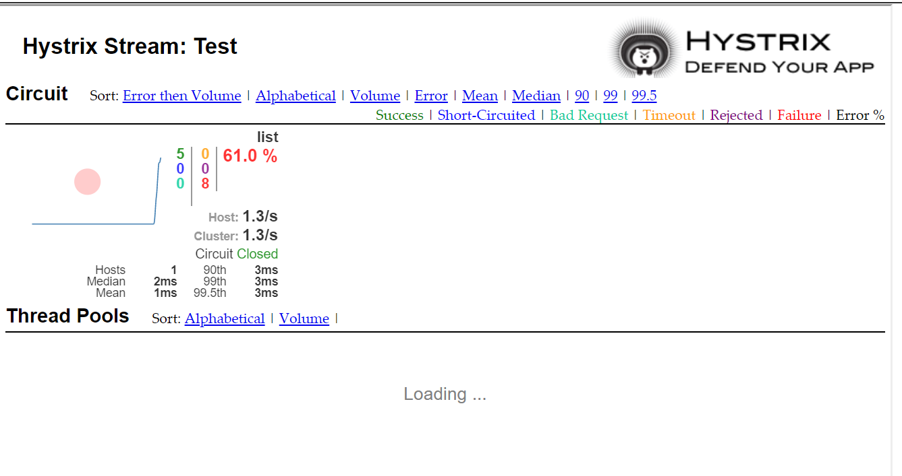

# Implementing Circuit Breaker for Microservice

#### New Annotations
* @EnableHystrix
* @EnableHystrixDashboard
* @EnableCircuitBreaker


# Circuit Breaker
* You'll build a microservice application that uses the Circuit Breaker pattern to gracefully degrade functionality when a method call fails. 
* Use of the Circuit Breaker pattern can allow a microservice to continue operating when a related service fails, preventing the failure from cascading and giving the failing service time to recover.


# Hystrix ( Netflix's Hystrix library provides an implementation of the Circuit Breaker pattern)
* when we apply a circuit breaker to a method, Hystrix watches for failing calls to that method, and if failures build up to a threshold, Hystrix opens the circuit so that subsequent calls automatically fail. 
* While the circuit is open, Hystrix redirects calls to the method, and they’re passed on to our specified fallback method.


* Spring Cloud Netflix Hystrix looks for any method annotated with the @HystrixCommand annotation, and wraps that method in a proxy connected to a circuit breaker so that Hystrix can monitor it.


```
import java.util.ArrayList;
import java.util.List;

import org.springframework.stereotype.Service;

import com.netflix.hystrix.contrib.javanica.annotation.HystrixCommand;

@Service
public class TransactionService {

	@HystrixCommand(fallbackMethod = "defaultTransactions")
	public List<String> list(Integer accountId) {
		System.out.println("Actual Method - accountId:" + accountId);
		ArrayList<String> list = new ArrayList<>();
		list.add("T1");
		list.add("T2");
		if (accountId == 1) {
			return list;
		} else {
			throw new RuntimeException("DB is down");
		}
	}

	public List<String> defaultTransactions(Integer accountId) {
		System.out.println("Fallback Method - AccountId:" + accountId);
		List<String> arrayList = new ArrayList<>();
		return arrayList;
	}

	public List<String> listAllAccounts() {
		System.out.println("listAllAccounts");
		ArrayList<String> list = new ArrayList<>();
		list.add("T1");
		list.add("T2");
		list.add("T3");
		list.add("T4");
		return list;
	}

}
```

#### Hystrix Dashboard

